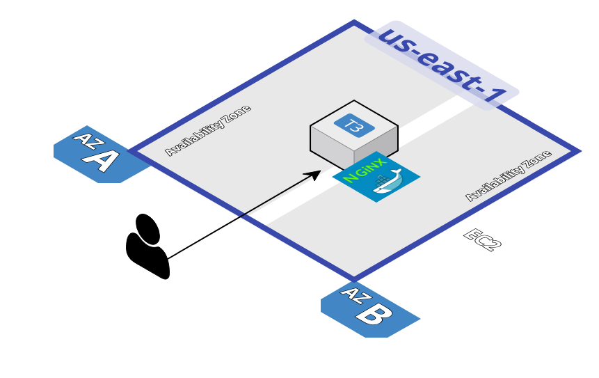

# Terraform Nginx on AWS EC2 Example

This repository provides a Terraform example for automated creation of a vanilla nginx server running on an EC2 instance in AWS. The primary purpose of this project is to demonstrate Terraform practices using the `terraform_starter` repository. This implementation is designed to be part of a larger Infrastructure as Code (IaC) effort, showcasing modular and sharable Terraform code.

## Overview

The modules used in this example are found in the branches `modules/vpc` and `modules/ec2` respectively. In this simplified example, branches were used for organization. In production environments, separate repositories for VPC and EC2 modules would be better practice.

Each branch contains Github action that performs CI on the Terraform code that include:

* Terraform fmt, init, plan - Basic Terraform specific checks
* TFsec - Security evaluation of Terraform code
* Infracost - Cost Estimates of Terraform code

## Requirements

- Terraform >= 1.1.0 or OpenTofu >= 1.8.8
- AWS account with appropriate permissions

This code has been tested with OpenTofu 1.8.8.

## Module Structure

The example uses two primary modules:

1. **VPC Module** - Creates the networking infrastructure
2. **EC2 Module** - Provisions the EC2 instance with Nginx

## Backend Configuration

It is best practice to include a backend.tf

Example backend configuration:
```hcl
terraform {
  backend "s3" {
    bucket         = <s3_bucket_for_tfstate>
    key            = <s3_key_for_tfstate>
    region         = <aws_region>
    dynamodb_table = <dynamodb_terraform_lock>  # optional: for state locking
    encrypt        = true
  }
}
```

## User Data Script

The EC2 instance is provisioned with the following script (provided as base64 in the variables):

```bash
#!/bin/bash

# install docker
apt-get update
apt-get install -y apt-transport-https ca-certificates curl software-properties-common
curl -fsSL https://download.docker.com/linux/ubuntu/gpg | apt-key add -
add-apt-repository "deb [arch=amd64] https://download.docker.com/linux/ubuntu noble stable"
apt-get update
apt-get install -y docker-ce docker-ce-cli containerd.io
systemctl start docker
systemctl enable docker

# setup up network for nginx
docker network create nginx

# create nginx container
docker run -d \
  --name nginx \
  --restart always \
  -p 80:80 \
  --network nginx \
  nginx:latest

echo "Waiting for nginx to start..."
while ! curl -s http://localhost:80 > /dev/null; do
  echo "Nginx not ready yet, waiting..."
  sleep 5
done

echo "nginx is up and running!"
docker ps | grep nginx
```

## Configuration

You can customize the deployment by creating a `terraform.tfvars` file with any of the following variables:

```hcl
vpc_module_source = "github.com/gear2000/terraform_starter?ref=vpc-v0.1"
ec2_module_source = "github.com/gear2000/terraform_starter?ref=ec2-v0.1"
aws_region        = "us-east-1"
vpc_name          = "nginx-example"
base_cidr         = "10.0"
num_of_subnets    = 2
vpc_labels = {
  Environment = "Development"
  Project     = "Nginx"
}
hostname          = "nginx-server"
ssh_key_name      = "default"  # Optional - your SSH key name
instance_type     = "t3.micro"
disksize          = "30"
cloud_labels = {
  Environment = "Development"
  Project     = "Nginx"
}
```

## Deployment 

Follow these steps to create the example:

```bash
tofu init
tofu plan -out=terraform.plan
tofu show terraform.plan
tofu apply terraform.plan
```

## Testing

After a successful deployment, you can test that Nginx is running correctly using:

1. **Via curl**:
   ```bash
   curl -I <nginx_url>
   ```

2. **Via browser**:
   Simply enter the output `nginx_url` in a web browser

## Cleanup 

Follow these steps to clean up

```bash
tofu init
tofu destroy 
```

## Outputs

The deployment provides the following outputs:
- `instance_id`: The ID of the created EC2 instance
- `public_dns`: The public DNS of the EC2 instance
- `nginx_url`: The URL to access the Nginx server (http://<public_dns>)

## Usage

Create terraform.tfvars

```terraform.tfvars
vpc_module_source = "github.com/gear2000/terraform_starter?ref=vpc-v0.1"
ec2_module_source = "github.com/gear2000/terraform_starter?ref=ec2-v0.1"
aws_region        = "us-east-1"
vpc_name          = "nginx-example"
base_cidr         = "10.0"
num_of_subnets    = 2
vpc_labels = {
  Environment = "Development"
  Project     = "Nginx"
}
hostname      = "nginx-server"
instance_type = "t3.micro"
disksize      = "30"
cloud_labels = {
  Environment = "Development"
  Project     = "Nginx"
}
```

## Considerations

This demonstrates the functionality and modularity of Terraform. Some considerations for making this more production-ready include:

- Autoscaling groups or Container Cluster Platforms (ECS and Kubernetes)
- Performance tests
- Load tests
- Smoke tests
- Monitoring/Telemetry
